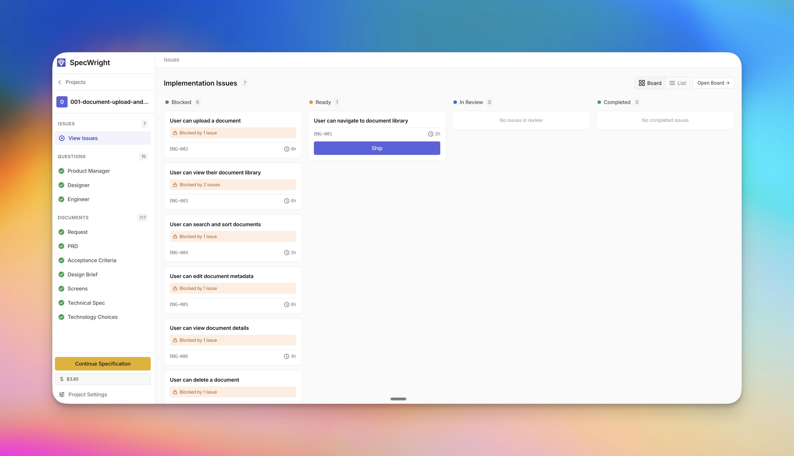
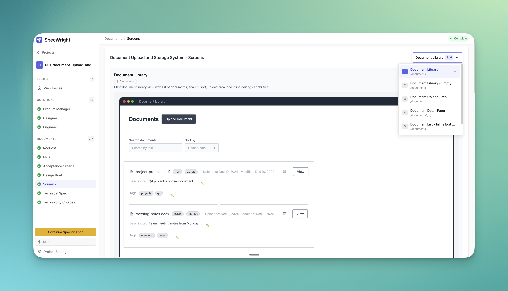
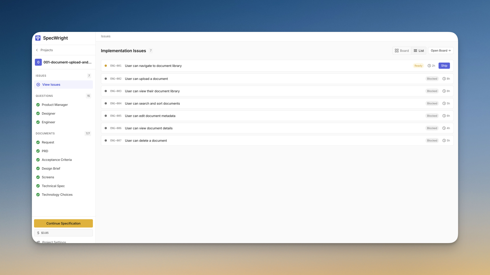
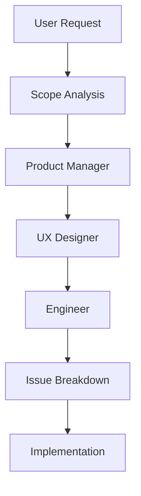

<div align="center">


# SpecWright

**AI-Powered Specification Engine**

Transform ideas into implementation-ready specifications using an AI squad of specialists.


*[Screenshot: Main interface showing the specification workflow]*

[](https://www.npmjs.com/package/specwright)
[](https://opensource.org/licenses/MIT)
[](https://nodejs.org)
[](https://github.com/amelmo/specwright/actions)
[](https://www.typescriptlang.org/)

[Installation](#-installation) • [Quick Start](#-quick-start) • [Features](#-features) • [Documentation](#-documentation) • [Contributing](#-contributing)

</div>

---

## 🎯 What is SpecWright?

SpecWright implements **Specification-Driven Development (SDD)**, a methodology where AI specialists collaborate to transform your project ideas into detailed, structured specifications before you write a single line of code.

### The Problem

Starting a new project or feature often means:
- ❌ Writing code before understanding requirements
- ❌ Missing edge cases and user needs
- ❌ Inconsistent documentation
- ❌ Technical debt from rushed decisions

You can download the CLI here: https://www.npmjs.com/package/specwright

### The Solution

SpecWright is a **Web UI for Specification-Driven Development** that automates the spec workflow for AI coding tools.

**How it works:**
- 🌐 **Web interface** for browsing and managing specifications
- 🤖 **Automated prompts** injected into your AI coding tool (Cursor, Windsurf, GitHub Copilot)
- 📋 **Context-aware** - automatically provides the right context at every step
- 🔄 **Seamless handoff** - specs flow directly into implementation

The AI Squad works through each phase:

```
📋 Product Manager → 🎨 Designer → 🔧 Engineer → 📊 Issue Breakdown
```

Each specialist creates structured outputs that feed into your AI coding assistant with the right prompts and context, ready for implementation.

---

## 📸 Interface Highlights

<table>
<tr>
<td width="50%">

### Project Dashboard
*[Screenshot: Project overview with status cards]*


Browse all projects, view progress, and track implementation tasks.

</td>
<td width="50%">

### Specification Viewer
*[Screenshot: Specification document view]*



Rich viewing experience for PRDs, designs, and technical specs.

</td>
</tr>
<tr>
<td width="50%">

### Issue Breakdown
*[Screenshot: Issue list with vertical slices]*



Implementation tasks organized by vertical slice with clear acceptance criteria.

</td>
<td width="50%">

### Technology Choices
*[Screenshot: Technology selection interface]*


Visual display of selected technologies with rationale and trade-offs.

</td>
</tr>
</table>

---

## ✨ Features

<table>
<tr>
<td width="50%">

### 🤖 AI Squad of Specialists
- **Product Manager**: Requirements, job stories, acceptance criteria
- **UX Designer**: Screen inventory, wireframes, user flows
- **Engineer**: Technical architecture, technology choices
- **Issue Breakdown**: Task breakdown using vertical slicing

</td>
<td width="50%">

### 🎯 Smart Scoping
Automatically classifies work:
- **Work Directly**: Small changes (just code it!)
- **Single Project**: One cohesive capability
- **Multiple Projects**: Break down large initiatives

</td>
</tr>
<tr>
<td width="50%">

### 🖥️ Dual Interface
- **Terminal CLI**: Fast, keyboard-driven workflow
- **Web UI**: Visual exploration and browsing
- **Cursor Integration**: Built-in commands

</td>
<td width="50%">

### 📚 Project Playbook
- Generate technical standards
- Audit compliance
- Track architectural evolution
- Version-controlled principles

</td>
</tr>
</table>

---

## 🚀 Installation

### Prerequisites

- **Node.js** 18 or higher
- **npm** 9 or higher

### Global Installation (Recommended)

```bash
# Install globally
npm install -g specwright

# Initialize in your project
cd /path/to/your/project
specwright init
```

### Local Development

```bash
git clone https://github.com/amelmo/specwright.git
cd specwright
npm install
npm run build
```

---

## ⚡ Quick Start

### 1. Scope Your Work

```bash
specwright new
```

The AI analyzes your request and determines if you need:
- A full project specification, or
- Just implement directly (no spec needed)

### 2. Generate Specifications (For Projects)

```bash
specwright spec
```

The AI squad works through each phase:
1. **Product Manager** - Creates PRD with job stories
2. **Designer** - Designs screens and wireframes
3. **Engineer** - Selects technologies and architecture
4. **Issue Breakdown** - Breaks down into implementation tasks

### 3. Browse Your Projects

```bash
specwright view
```

Visual dashboard showing:
- All projects and their status
- Implementation tasks (issues)
- Progress tracking

---

## 📖 Documentation

| Document | Description |
|----------|-------------|
| [QUICKSTART.md](QUICKSTART.md) | Get started in 5 minutes |
| [ARCHITECTURE.md](ARCHITECTURE.md) | Technical architecture details |
| [CONTRIBUTING.md](CONTRIBUTING.md) | How to contribute |
| [CHANGELOG.md](CHANGELOG.md) | Version history |
| [SECURITY.md](SECURITY.md) | Security policy |

---

## 🎨 Example Output

SpecWright generates structured, version-controllable specifications:

```
outputs/
├── project_plan.json              # Overall scope
└── projects/
    └── 001-user-authentication/
        ├── project_request.md
        ├── pm/
        │   └── product_manager_output.md    # PRD with job stories
        ├── ux/
        │   ├── screen_inventory.json
        │   └── ux_designer_output.md        # Wireframes
        ├── architect/
        │   ├── engineer_output.md           # Architecture
        │   └── technology_choices.json      # Tech stack
        └── tech_lead/
            ├── project_summary.json         # Task breakdown
            └── issues/
                ├── ENG-001.md               # Login UI
                ├── ENG-002.md               # JWT Auth
                └── ENG-003.md               # Password Reset
```

---

## 🛠️ Technology Stack

<div align="center">

| Category | Technologies |
|----------|-------------|
| **Language** | TypeScript 5.x |
| **Runtime** | Node.js 18+ |
| **CLI** | Inquirer, Chalk, Consola |
| **Web UI** | React 18, Vite, TailwindCSS, Radix UI |
| **Build** | TypeScript Compiler, Vite |

</div>

---

## 📊 Workflow



---

## 🤝 Contributing

We welcome contributions! See [CONTRIBUTING.md](CONTRIBUTING.md) for guidelines.

### Development Setup

```bash
# Clone and install
git clone https://github.com/amelmo/specwright.git
cd specwright
npm install

# Run in development
npm run dev          # CLI
npm run dev:ui       # Web UI
npm run type-check   # Type checking
```

---

## 📝 License

MIT License - see [LICENSE](LICENSE) for details.

---

## 🙏 Acknowledgments

Built with ❤️ for **Specification-Driven Development**

### Inspired By

SpecWright builds upon proven methodologies and tools:

- **[Jobs-to-be-Done Framework](https://jtbd.info/)** - Using job stories to capture user needs and context, focusing on the "why" behind features rather than just "what" users want.

- **[Shape Up](https://basecamp.com/shapeup)** - 37signals' approach to product development emphasizing:
  - Shaping work before committing to it
  - Making trade-offs explicit
  - Clear boundaries on No-Gos when writing specs

- **[Linear](https://linear.app/)** - The gold standard for issue tracking, inspiring our:
- Project and Issues hierarchy of information

  - Clean, fast interface design
  - Vertical slice organization

These frameworks inform SpecWright's AI-powered approach to specification-driven development.

---

## 📬 Contact & Support

- **Issues**: [GitHub Issues](https://github.com/amelmo/specwright/issues)
- **Discussions**: [GitHub Discussions](https://github.com/amelmo/specwright/discussions)
- **Email**: [julien@argil.io](mailto:julien@argil.io)

---

<div align="center">

**[⭐ Star us on GitHub](https://github.com/amelmo/specwright)** • **[📦 View on npm](https://www.npmjs.com/package/specwright)**

Made with TypeScript • Powered by AI • Built for Developers

</div>
