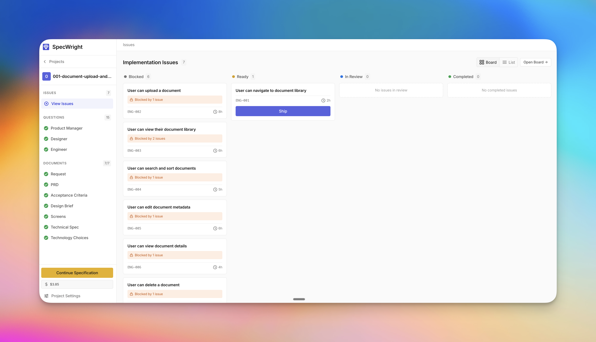
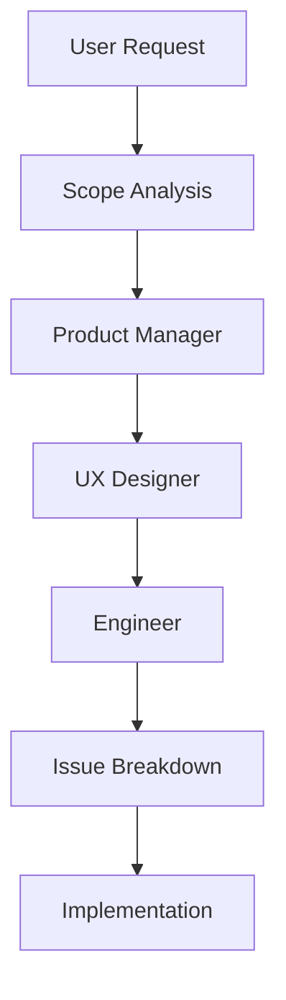
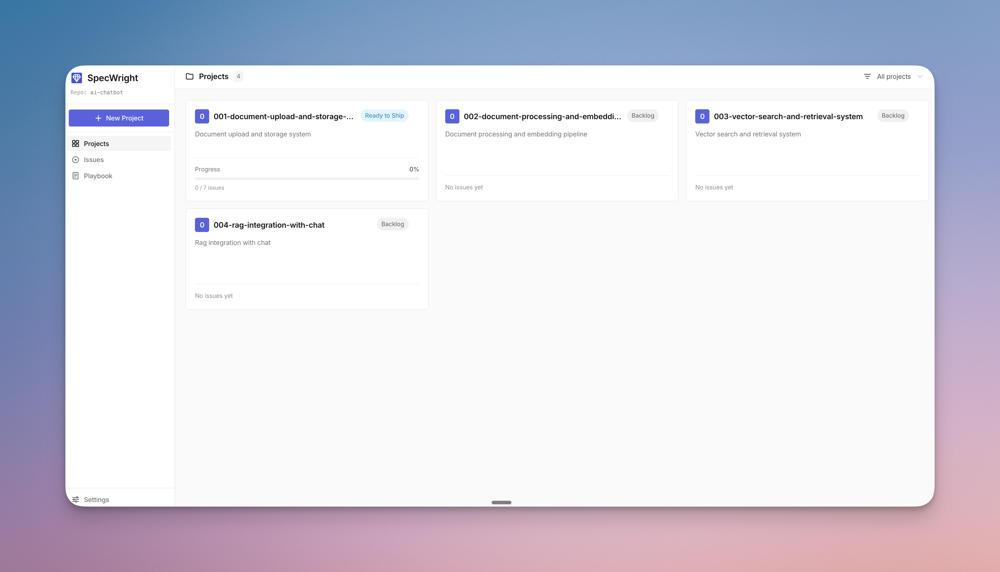
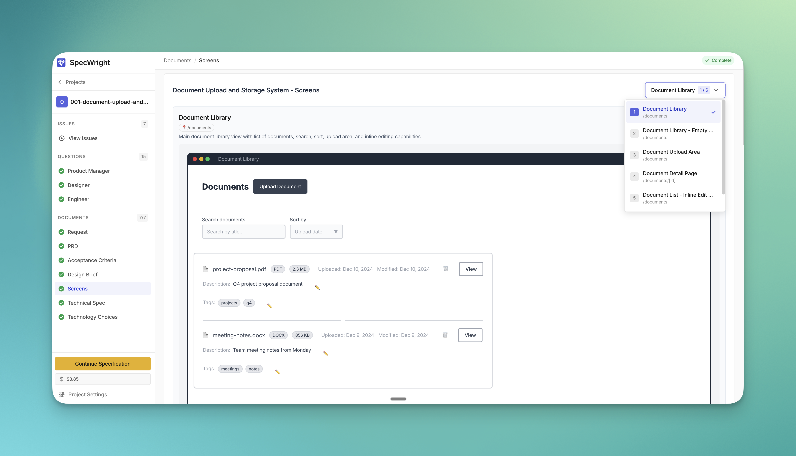
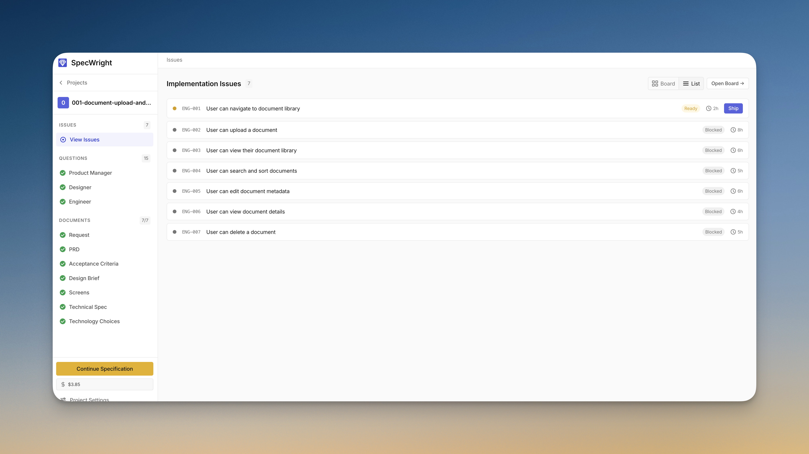
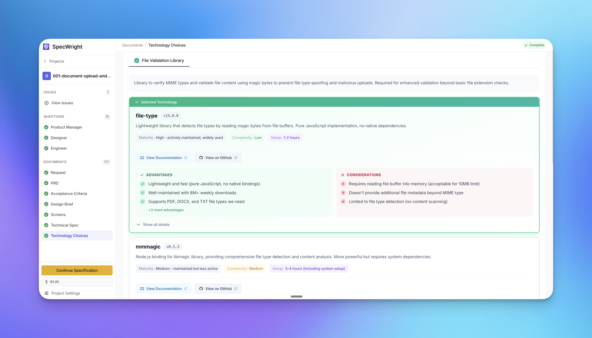

<div align="center">


# SpecWright

Generate structured, implementation-ready specifications from a project idea — before you write a single line of code.

[](https://www.npmjs.com/package/specwright)
[](https://opensource.org/licenses/MIT)
[](https://nodejs.org)
[](https://github.com/amelmo/specwright/actions)
[](https://www.typescriptlang.org/)

[Quick Start](#quick-start) · [How It Works](#how-it-works) · [Screenshots](#screenshots) · [Documentation](#documentation) · [Contributing](#contributing)

</div>



SpecWright is a CLI + Web UI that runs AI specialists through a structured workflow — Product Manager, Designer, Engineer, Issue Breakdown — to produce PRDs, wireframes, architecture docs, and implementation tasks. The output is file-based, version-controllable, and designed to feed directly into AI coding tools like Cursor, Windsurf, and GitHub Copilot.

## Quick Start

**Prerequisites:** Node.js 18+, npm 9+

```bash
npm install -g specwright
```

```bash
# Initialize in your project directory
cd /path/to/your/project
specwright init

# Scope your work — the AI determines if you need a full spec or can code directly
specwright new

# Generate specifications (if a full spec is needed)
specwright spec

# Browse projects and specs in a visual dashboard
specwright view
```

## How It Works

SpecWright implements Specification-Driven Development: AI specialists collaborate in sequence, each phase producing structured outputs that feed into the next.


```mermaid
graph TD
    A[User Request] --> B[Scope Analysis]
    B --> C[Product Manager]
    C --> D[UX Designer]
    D --> E[Engineer]
    E --> F[Issue Breakdown]
    F --> G[Implementation]
```

| Phase | Specialist | Output |
|-------|-----------|--------|
| **1. Scope** | AI classifier | Determines if you need a full spec or can implement directly |
| **2. Product** | Product Manager | PRD with job stories and acceptance criteria |
| **3. Design** | UX Designer | Screen inventory, wireframes, user flows |
| **4. Architecture** | Engineer | Technology choices, technical architecture |
| **5. Breakdown** | Tech Lead | Implementation tasks organized by vertical slice |

Each phase's output is injected as context into your AI coding tool, giving it the right prompts and specifications at every step.

### Output Structure

Specs are saved as version-controllable files in your project:

```
outputs/
├── project_plan.json
└── projects/
    └── 001-user-authentication/
        ├── project_request.md
        ├── pm/
        │   └── product_manager_output.md    # PRD with job stories
        ├── ux/
        │   ├── screen_inventory.json
        │   └── ux_designer_output.md        # Wireframes
        ├── architect/
        │   ├── engineer_output.md           # Architecture
        │   └── technology_choices.json      # Tech stack
        └── tech_lead/
            ├── project_summary.json         # Task breakdown
            └── issues/
                ├── ENG-001.md               # Login UI
                ├── ENG-002.md               # JWT Auth
                └── ENG-003.md               # Password Reset
```

## Screenshots

<table>
<tr>
<td width="50%">

**Project Dashboard**



Browse all projects, view progress, and track implementation status.

</td>
<td width="50%">

**Specification Viewer**



Rich viewing for PRDs, screen designs, and technical specs.

</td>
</tr>
<tr>
<td width="50%">

**Issue Breakdown**



Implementation tasks organized by vertical slice with acceptance criteria.

</td>
<td width="50%">

**Technology Choices**



Selected technologies with rationale, trade-offs, and alternatives.

</td>
</tr>
</table>

## Documentation

| Document | Description |
|----------|-------------|
| [QUICKSTART.md](QUICKSTART.md) | Get started in 5 minutes |
| [ARCHITECTURE.md](ARCHITECTURE.md) | Technical architecture and tech stack |
| [CONTRIBUTING.md](CONTRIBUTING.md) | How to contribute |
| [CHANGELOG.md](CHANGELOG.md) | Version history |
| [SECURITY.md](SECURITY.md) | Security policy |

## Contributing

Contributions welcome — see [CONTRIBUTING.md](CONTRIBUTING.md) for full guidelines.

```bash
git clone https://github.com/amelmo/specwright.git
cd specwright
npm install

npm run dev          # CLI in debug mode
npm run dev:ui       # Web UI with Vite HMR
npm run type-check   # TypeScript checking
```

## Acknowledgments

SpecWright builds on ideas from [Jobs-to-be-Done](https://jtbd.info/) (job stories over feature lists), [Shape Up](https://basecamp.com/shapeup) (shaping work before committing), and [Linear](https://linear.app/) (clean issue hierarchy and vertical slices).

## License

MIT — see [LICENSE](LICENSE) for details.

<div align="center">

**[View on npm](https://www.npmjs.com/package/specwright)** · **[Report an Issue](https://github.com/amelmo/specwright/issues)** · **[Discussions](https://github.com/amelmo/specwright/discussions)**

</div>
